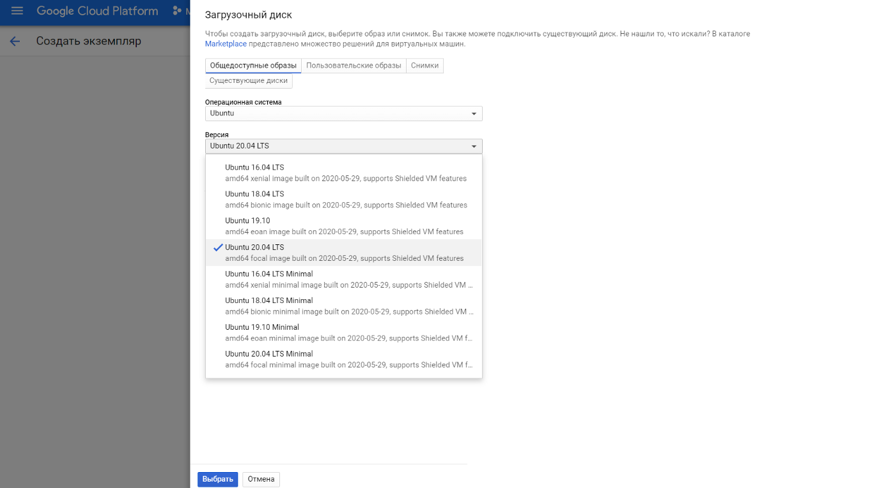
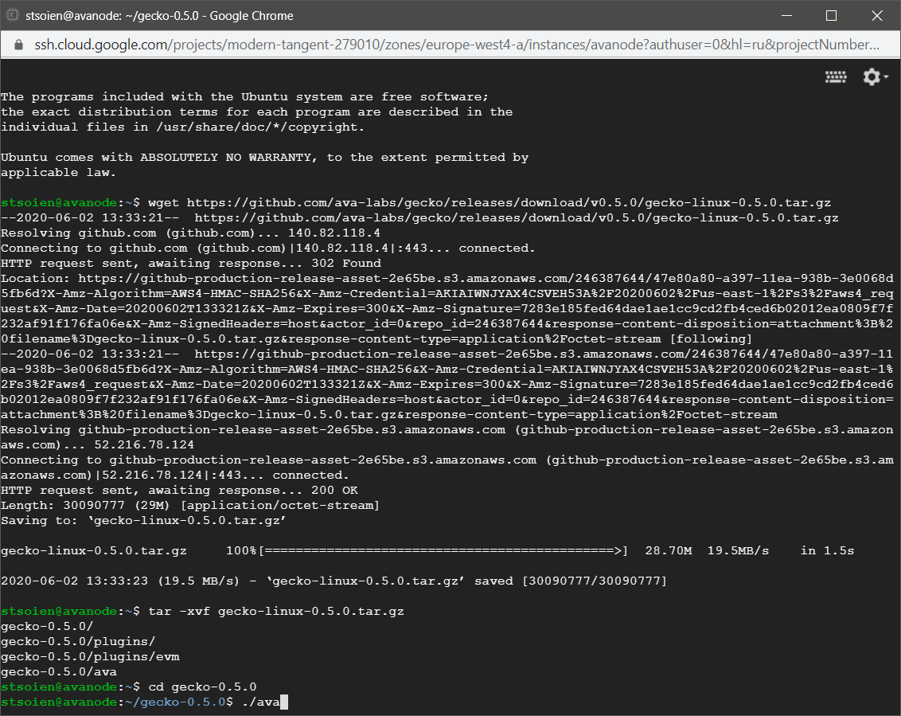
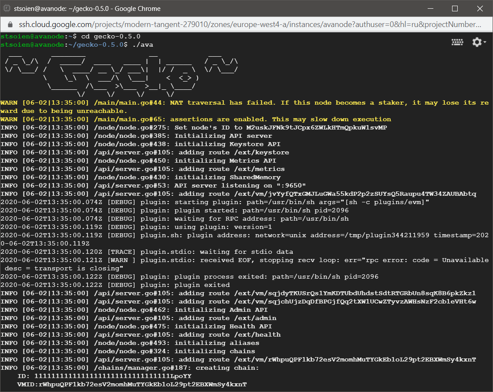
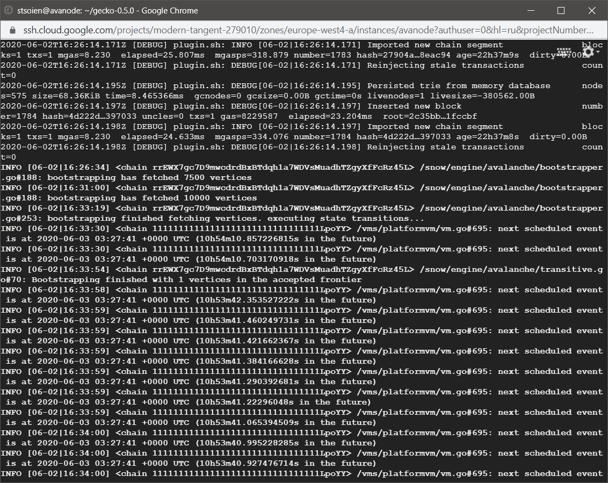
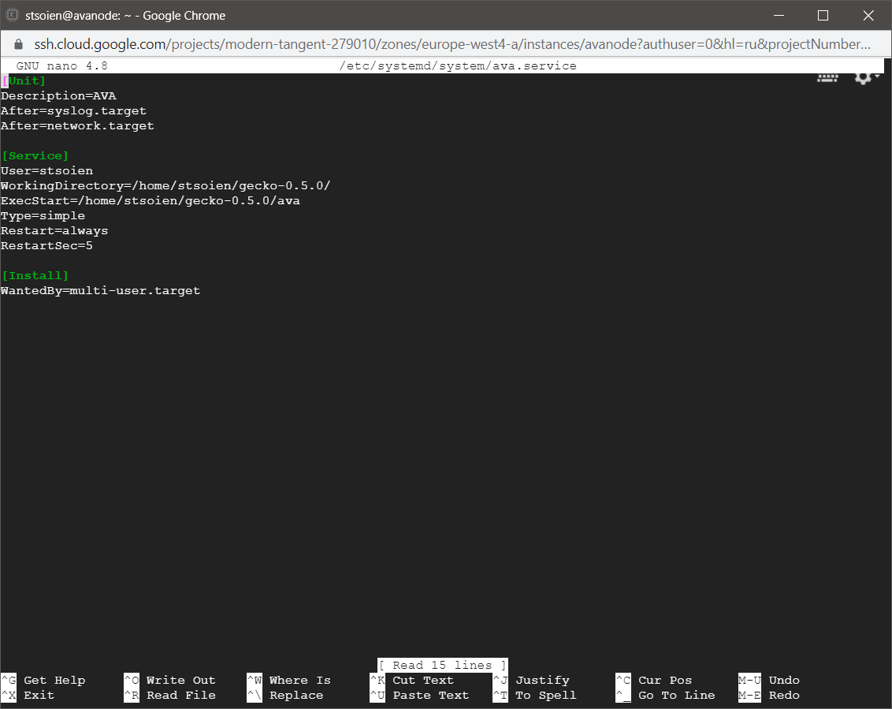
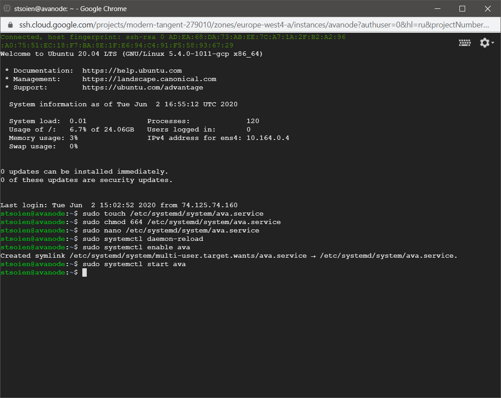
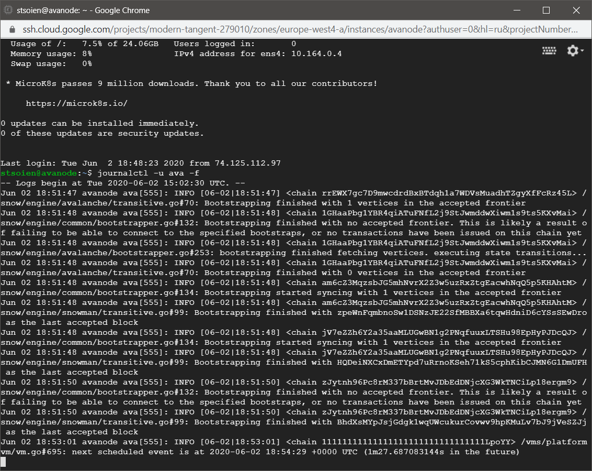

# Запуск релиза AVA Denali

## Запуск релиза AVA Denal

Инструкция на примере VPS от Google Cloud. Почему именно его — да, дорогой, но в целом, за счет бонусных кредитов, получается 4–6 месяцев использования VPS бесплатно. Так что сойдет\)

Выбирался конфиг с ядрами n1, 2 ядра и 7,5 гб оперативной памяти. самое главное при установке — обратить внимание на версию Ubuntu. По нумерации подойдет 20.04, в ней все есть, все работает стабильно. Нужна версия LTS, а не самая нижняя Minimal:



После установки запускаем терминал нажатием на кнопку SSH, и ждем пока он загрузится.

Отдельно стоит отметить, что на этот раз не требуется возиться установкой Go и настройкой Gopatch.

Устанавливаем сам клиент Gecko:

```text
wget https://github.com/ava-labs/gecko/releases/download/v0.5.0/gecko-linux-0.5.0.tar.gz
tar -xvf gecko-linux-0.5.0.tar.gz
cd gecko-0.5.0
./ava
```



После этого останется только нажать Enter, чтобы нода запустилась и можно было бы перейти к процессу запуска валидации:



Дальше ждем, пока нода не синхронизируется до конца, это может занять более 1 часа. Когда появится вот такой текст, значит, нода синхронизирована:



Далее закрываем терминал с запущенной нодой, она останавливается и создаем конфигурационный файл, чтобы нода запускалась как сервис и сама поднималась обратно в случае произвольного краша или закрытия окна терминала. Почему так — потому что на некоторых VPS команда screen может работать некорректно и при закрытии терминала нода все равно останавливается:

```text
sudo touch /etc/systemd/system/ava.service
sudo chmod 664 /etc/systemd/system/ava.service
sudo nano /etc/systemd/system/ava.service
```

После последней команды \(надо нажать enter\) откроется текстовый редактор с пустым файлом, в который надо скопировать:

```text
[Unit]
Description=AVA
After=syslog.target
After=network.target [Service]
User=user
WorkingDirectory=/home/user/gecko-0.5.0/
ExecStart=/home/user/gecko-0.5.0/ava
Type=simple
Restart=always
RestartSec=5 [Install]
WantedBy=multi-user.target
```



**Внимание! На месте user \(stsoien\) должно быть имя пользователя \(обозначено зеленым вроде stsoien@avanode до @. То есть, вводите на место user то, что на скрине на месте stsoien, последнюю строку править не нужно\).** Чтобы сохранить изменения — нажмите комбинацию клавиш Ctrl+O, подтвердите название файла на Enter, после чего вернетесь обратно в редактирование файла. Изменения сохранены, можно закрыть комбинацей клавиш Ctrl+X. И далее:

```text
sudo systemctl daemon-reload
sudo systemctl enable ava
sudo systemctl start ava
```



После этого желательно перезапустить сам vps. Именно перезапустить нажатием на кнопку остановки и потом — запуска, после того, как полностью остановится. Кнопка рестарта например, именно у гугла работает некорректно. Теперь все, после перезапуска нода автоматически работает в фоне и сама рестартится при крашах. Для того, чтобы проверить, как работает нода:

```text
journalctl -u ava -f
```



Дальше, по запуску валидации все идентично тому, что было в Cascade, с одним нюансом \(ниже\):

А именно: надо поставить больше endtime, пусть будет 60 дней.

```text
curl -X POST --data '{
    "jsonrpc": "2.0",
    "method": "platform.addDefaultSubnetValidator",
    "params": {
        "id":"YOUR NODE ID",
        "payerNonce":2,
        "destination":"YOUR P-CHAIN ADDRESS",
        "startTime":'$(date --date="5 minutes" +%s)',
        "endTime":'$(date --date="60 days" +%s)',
        "stakeAmount":10000
    },
    "id": 1
}' -H 'content-type:application/json;' 127.0.0.1:9650/ext/P
```

После выполнения всех этих действий запустится валидация, и можно спокойно все закрыть — нода будет крутиться на VPS.**Telegram RU:** [https://t.me/AVA\_Russia](https://t.me/AVA_Russia)

* **Telegram RU:** [https://t.me/AVA\_Russia](https://t.me/AVA_Russia)
* **Medium RU:** [https://medium.com/ava-russia](https://medium.com/ava-russia)
* **Twitter RU:** [https://twitter.com/Ava\_Russia](https://twitter.com/Ava_Russia)
* **Discord \(для разработчиков\):** [_https://discord.gg/ccc8vEP_](https://discord.gg/ccc8vEP)
* **Канал объявлений:** [https://t.me/AVA\_announcements](https://t.me/AVA_announcements)
* **YouTube:** [https://www.youtube.com/](https://www.youtube.com/channel/UCScsLTtz5DCwJodZ8ht9KNA)
* **Сайт проекта:** [https://www.avalabs.org/](https://www.avalabs.org/)
* **AVA HUB:** [https://community.ava.network/](https://community.ava.network/)
* **Репозиторий GitHub:** [_https://github.com/ava-labs/gecko_](https://github.com/ava-labs/gecko)
* **Документация:** [_https://docs.ava.network/_](https://docs.ava.network/)
* **Программа Accelerator для разработчиков:** [_http://avalabs.org/dap_](http://avalabs.org/dap)
* **Facebook:** [_https://www.facebook.com/AvaLabsOfficial_](https://www.facebook.com/AvaLabsOfficial)
* **Reddit:** [_https://www.reddit.com/r/ava_](https://www.reddit.com/r/ava)
* **Linkedin:** [_https://www.linkedin.com/company/ava-labs_](https://www.linkedin.com/company/ava-labs)

